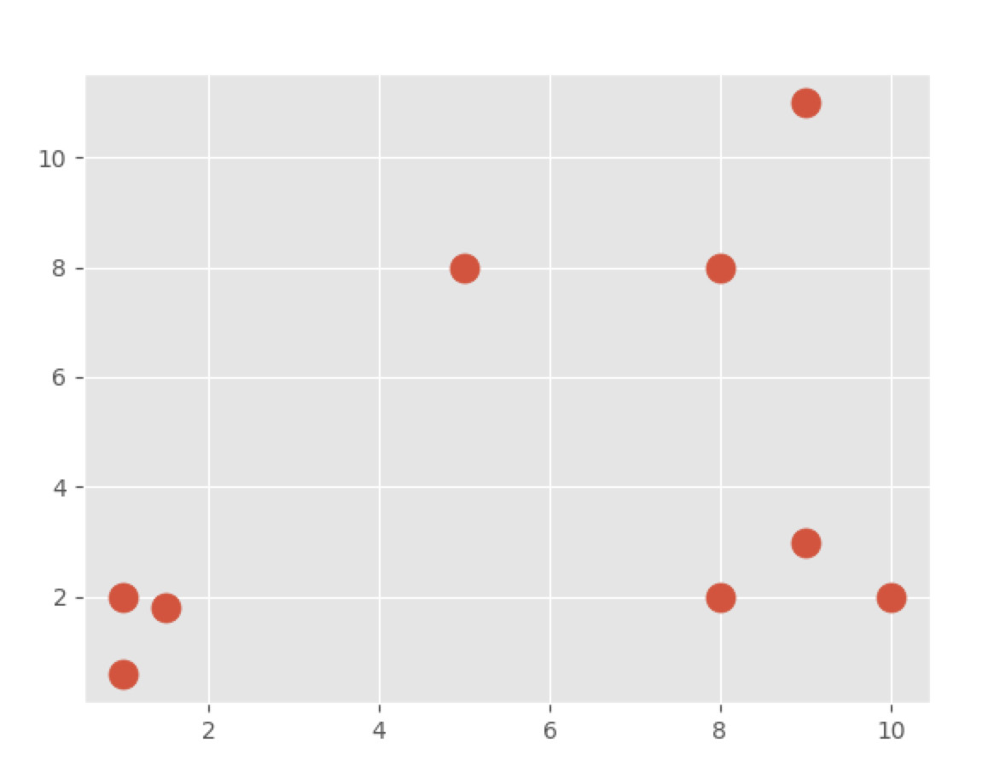
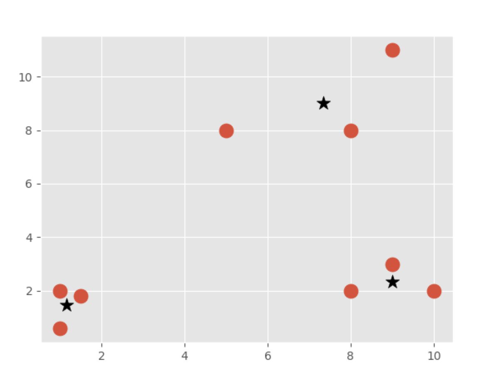

# Mean Shift from Scratch
## - Practical Machine Learning Tutorial with Python p.41

Welcome to the 41st part of our machine learning tutorial series, and another tutorial within the topic of Clustering..

In this tutorial, we begin building our own mean shift algorithm from scratch. To begin, we will start with some code from part 37 of this series, which was when we began building our custom K Means algorithm. I will add one more cluster/group to the original data. Feel free to add the new data or leave it the same as it was.

## Output of current file
I have fixed a problem that I faced here by adding a folder
Starting with the following as data only:

After apply our algorithm of Mean-Shift we obtain

## - My Note
Here will continue our Machine-Learning Class that we we have already developed in the past. Mean-Shift algorithm will be developed from scratch, we have used the **band_width** or as we have refer to it here as **radius** to reflect the distance among the groups of being accepted.
#

## Acknowledgments
* Based on sentdex Youtube Channel, modified to serve the purpose that I need in my academic research.

## Inspiration
following this project from:
My Original thoughts.

## Template elements:
<kbd>Ctrl</kbd>
## Adding more features:
## Requirements
python 0.x  
Packages: see **requirements.txt**  
## Instructions
1. Install all required packages
2. Modify parameters if desired
3. Run **folder/script.R**
