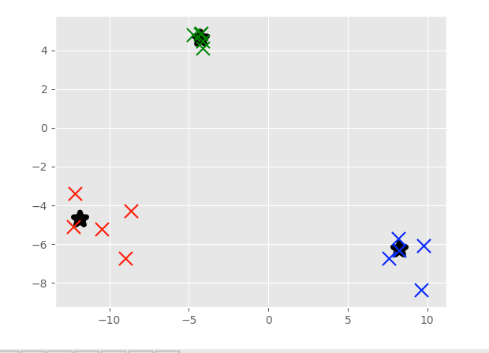

# Mean Shift Dynamic Bandwidth - Practical Machine
## Learning Tutorial with Python p.42

We're going to continue working on our custom Mean Shift algorithm from scratch.

## Output of current file
To run this file use

```
python ~/3_PracticalMachineLearning/Projectfiles/P42_MeanShiftDynamicBandwidth.py
```




## - My Note
We will add a **weight** to the algorithm to avoid changing the radius after a specific value.
#

## Acknowledgments
* Based on sentdex Youtube Channel, modified to serve the purpose that I need in my academic research.

## Inspiration

https://pythonprogramming.net/weighted-bandwidth-mean-shift-machine-learning-tutorial/


## Template elements:
<kbd>Ctrl</kbd>
## Adding more features:
## Requirements
python 0.x <br />
Packages: see **requirements.txt** <br />
## Instructions
1. Install all required packages
2. Modify parameters if desired
3. Run **folder/script.R**
