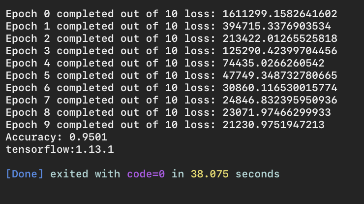

# Deep Learning with Neural Networks and TensorFlow
## - Running our Network p.47
We are using the following version of TensorFlow

```py
python -c "import tensorflow; print('Tensorflow library version is =',tensorflow.__version__)"
```
which is:

```py
Tensorflow library version is = 1.13.1
```

## Output of current file
To run this file use

```
python ~/3_PracticalMachineLearning/Projectfiles/P47_XXX.py
```
## - My Note
We will continue form P.46 and here we go.



## Acknowledgments
* Based on sentdex Lectures, modified to serve the purpose that I need in my academic research.

## Inspiration

https://pythonprogramming.net/tensorflow-introduction-machine-learning-tutorial/

## Template elements:
<kbd>Ctrl</kbd>
## Adding more features:
## Requirements
python 0.x <br />
Packages: see **requirements.txt** <br />
## Instructions
1. Install all required packages
2. Modify parameters if desired
3. Run **folder/script.R**
