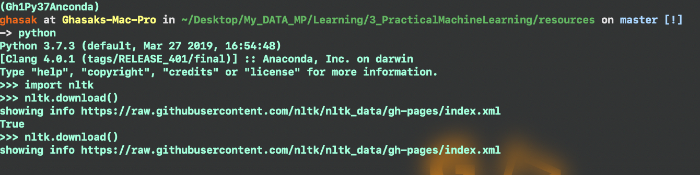
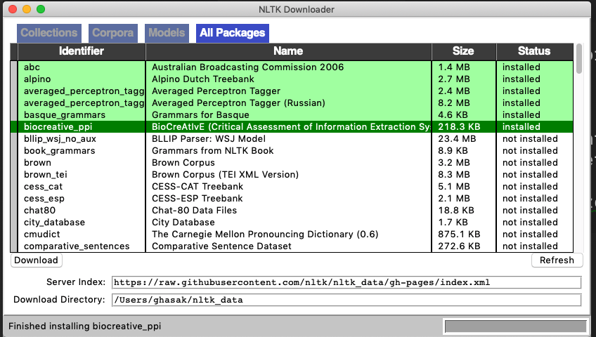

# Deep Learning with Neural Networks and TensorFlow
# - Processing our own Data p.48 and P.49 - Part 5-6
We are using the following version of TensorFlow

```py
python -c "import tensorflow; print('Tensorflow library version is =',tensorflow.__version__)"
```
which is:

```py
Tensorflow library version is = 1.13.1
```

## Output of current file
To run this file use

```
python ~/3_PracticalMachineLearning/Projectfiles/P48_XXX.py
```
## - My Note
We will work with both negative and positive sentiment data set. We will come up with a dictionary for words we know and convert to a vector form to get the results.

## NOTE
We will need a package called **nltk** short for **Natural Language tool-Kit** and after you get to install the tool first using

```py
pip install nltk
```
Later you can go the next step, which is to show the following, in the terminal specifically.This will open either a GUI, or stay headless. Go ahead and just download all. If you are in GUI form, just choose download all. If you are in the text version, type d, then all. Once that's done, you're ready to progress. If you're lost or confused, check out the first NLTK tutorial for installing NLTK.

```py
import nltk
nltk.download()
then pick the option -all
```
Here is how you install them all together see



Then you will get the results as,



## Hint
Read more about Natural language processing in our different project file that we worked on. Starting with stemming then lemmatizing.

# What we will need
We need the following packages

```py
import nltk
from nltk.tokenize import word_tokenize
import numpy as np
import random
import pickle
from collections import Counter
from nltk.stem import WordNetLemmatizer
```
For example the word_tokenize is a tool used to separate a sentence into a words in a list similar to **string.split()** method. These are just some necessary imports. NLTK has been explained, numpy is a given, random will be used to shuffle the data, Counter will be used for sorting most common lemmas, and pickle to save the process so that we dont need to do it every time. We define the lemmatizer, and then we set the hm_lines value. 100,000 will do all of the lines, there are just over 10,000 lines. If you want to test something new, or shrink the total data size for a smaller computer/processor, you can set a smaller number here. I mostly used this for quickly testing new functions..etc. No reason to run through the entire set to just quickly test a different method.


# Proceeding with our Model

We will create two functions one for reading the txt files of both pos and neg. which we will use later to convert it to a vector that we will use to train our model. So that in the end once we put a text the machine learning through the natural language process will tell us this is a negative sentence or positive sentence.

Here is the code so far

```py
import nltk
from nltk.tokenize import word_tokenize
import numpy as np
import random
import pickle
from collections import Counter
from nltk.stem import WordNetLemmatizer

lemmatizer = WordNetLemmatizer()
hm_lines = 100000


def create_lexicon(pos,neg):
    lexicon = []
    for fi in [pos, neg]:
        with open(fi, 'r') as f:
            contents = f.readlines()
            for l in contents[:hm_lines]
                all_words = word_tokenize(l.lower()) # Method for lower cases.
                lexicon += list(all_words)


    lexicon = [lemmatizer.lemmatize(i) for in lexicon]
    w_counts = Counter(lexicon)
    # w_counts = {'the':4535, 'and':2312 ...etc} we are expecting the results to be a dictionary.
    l2 = []
    for w in w_counts:
        if 1000 > w_counts[w] > 50: # We are saying not the super common words, like "the", "and",..etc.
            l2.append(w)

    return l2

```
And sample_handling code is here, the result will get something similar to a list of a list [[[0 0 1 0 1], [1 0]]] : where the first part represent the hot list of our current sentence with another list of [1,0] represent this sentence is positive or negative.

```py
def sample_handling(sample, lexicon, classification):
    featureset = []

    with open(sample, 'r') as f:
        contents = f.readlines()
        for l in contents[:hm_lines]:
            current_words = word_tokenize(l.lower())
            current_words = [lemmaitizer.lemmatize(i) for i in current_words]
            features = np.zeros(len(lexicon))
            for word in current_words:
                if word.lower() in lexicon:
                    index_value = lexcion.index(word.lower())
                    features[index_value] +=1
            features = list(features)
            featureset.append([features, classification])

```

Our final mission is to find out if
tf.argmax([output]) ++ tf.argmax([expectations])


## Acknowledgments
* Based on sentdex Lectures, modified to serve the purpose that I need in my academic research.

## Inspiration
https://www.youtube.com/watch?v=7fcWfUavO7E&list=PLQVvvaa0QuDfKTOs3Keq_kaG2P55YRn5v&index=48&frags=pl%2Cwn


## Template elements:
<kbd>Ctrl</kbd>
## Adding more features:
## Requirements
python 0.x <br />
Packages: see **requirements.txt** <br />
## Instructions
1. Install all required packages
2. Modify parameters if desired
3. Run **folder/script.R**
