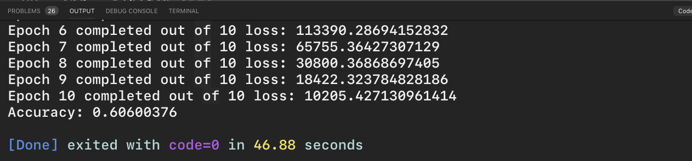
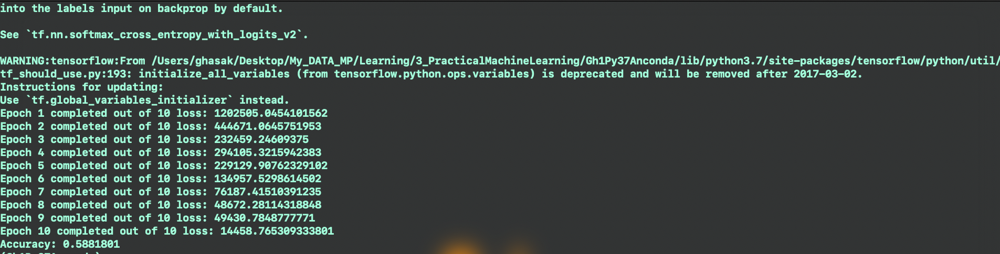

# Deep Learning with Neural Networks and TensorFlow
# - Processing our own Data p.48 and P.49 - Part 5-6-7
We are using the following version of TensorFlow

```py
python -c "import tensorflow; print('Tensorflow library version is =',tensorflow.__version__)"
```
which is:

```py
Tensorflow library version is = 1.13.1
```

## Output of current file
To run this file use

```
python ~/3_PracticalMachineLearning/Projectfiles/P49_XXX.py
```
## - My Note
After saving our **.pickle** file which contains all our dataset in the form of x_test, y_test, x_train, y_train, here will proceed with our modeling technique. Starting with a code snippet,

```py

```


# PROBLEM
You will follow the error in a way written as

```py
2315, in _ensure_xent_args
    "named arguments (labels=..., logits=..., ...)" % name)
ValueError: Only call `softmax_cross_entropy_with_logits` with named arguments (labels=..., logits=..., ...)
```
I have fixed the error in the tensorflow library that the code is changed from

```py
tf.reduce_mean( tf.nn.softmax_cross_entropy_with_logits(prediction,y) )
```
to

```py
tf.reduce_mean( tf.nn.softmax_cross_entropy_with_logits(logits = prediction, labels=y) )
```

Now the script is running and give outputs at:



Or through terminal




## Acknowledgments
* Based on sentdex Lectures, modified to serve the purpose that I need in my academic research.

## Inspiration
https://www.youtube.com/watch?v=7fcWfUavO7E&list=PLQVvvaa0QuDfKTOs3Keq_kaG2P55YRn5v&index=48&frags=pl%2Cwn


## Template elements:
<kbd>Ctrl</kbd>
## Adding more features:
## Requirements
python 0.x <br />
Packages: see **requirements.txt** <br />
## Instructions
1. Install all required packages
2. Modify parameters if desired
3. Run **folder/script.R**
