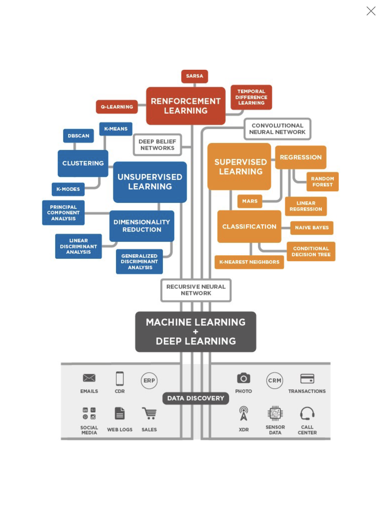

# Practical Machine Learning -
## Starting Point for this project.
Starting here from Mean Shift Into.-Practical Machine Learning Tutorial with python p.39.

## - Machine Learning Advanced Topics
Here will continue our Machine-Learning Class that we we have already developed in the past. The programs here support Machine Learning with several methods such as:
### Machine learning Methods
* K-Means
* Nearest distance
* Support Vector machine
* Mean Shift

#
## Authors

* **Ghasak Ibrahim** - *Initial work* -

## License
This project is licensed under the MIT License - see the [LICENSE.md](LICENSE.md) file for details
## Acknowledgments
* Based on sentdex Youtube Channel, modified to serve the purpose that I need in my academic research.

## Inspiration
following this project from:
My Original thoughts.

## To add some keyboard keys use:
<kbd>Ctrl</kbd>
## Adding more features:
## Requirements
python 0.x  
Packages: see **requirements.txt**  
## Instructions
1. Install all required packages
2. Modify parameters if desired
3. Run **folder/script.R**
